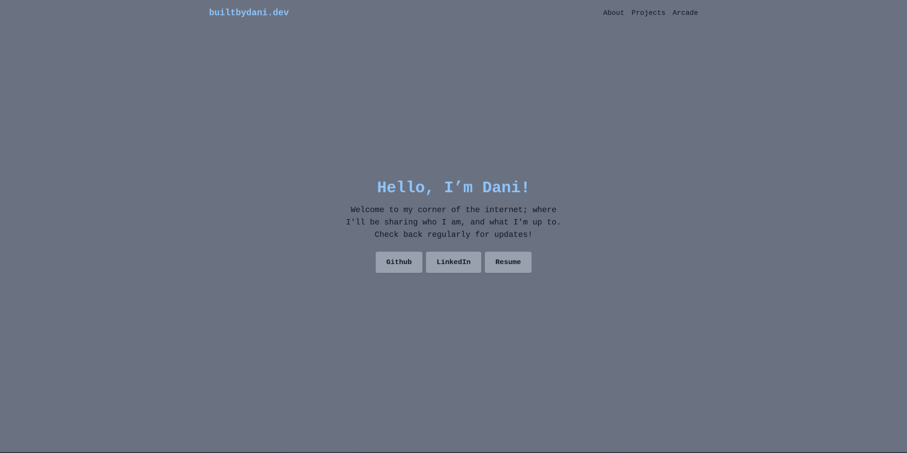
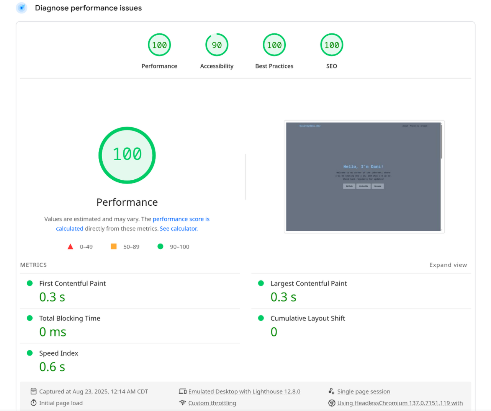

# builtbydani.dev 🌐

Welcome to the source code for my personal site — [builtbydani.dev](https://builtbydani.dev)!

This site is my digital home base: a portfolio, a playground, and a vibe all in one.  
Built with love, TypeScript, and Tailwind — and deployed with Vercel.

## 🌈 Features

- Fully responsive design (looks cute on desktop *and* mobile 💖)
- Scroll-reactive frosted glass navbar
- Hero section with buttons linking to socials/professional resume
- Project showcase with soft card UI and GitHub/live deploy links
- Hosted live at [builtbydani.dev](https://builtbydani.dev)

## 🛠️ Built With

- [React](https://reactjs.org/) + [TypeScript](https://www.typescriptlang.org/)
- [Vite](https://vitejs.dev/) for fast builds
- [Tailwind CSS](https://tailwindcss.com/) for styling
- [Vercel](https://vercel.com/) for deployment

## 🚧 In Progress

- Maybe a blog or devlog section soon?
- Thinking about adding Framer Motion or dynamic GitHub API project loading

## 📸 Preview

## 🌐 Google PageSpeed Insights

---

Thanks for visiting!
Questions?
🖤 [me@builtbydani.dev](mailto:me@builtbydani.dev)
